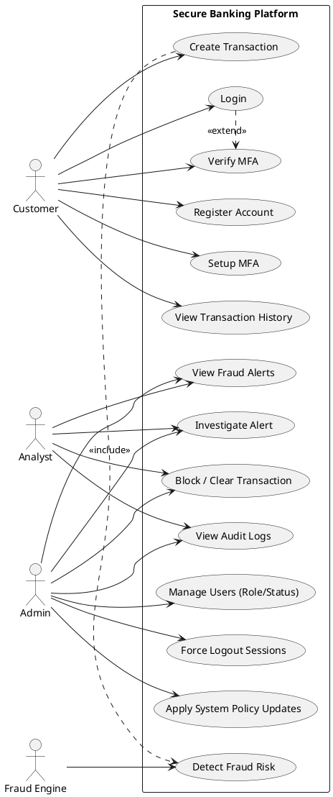
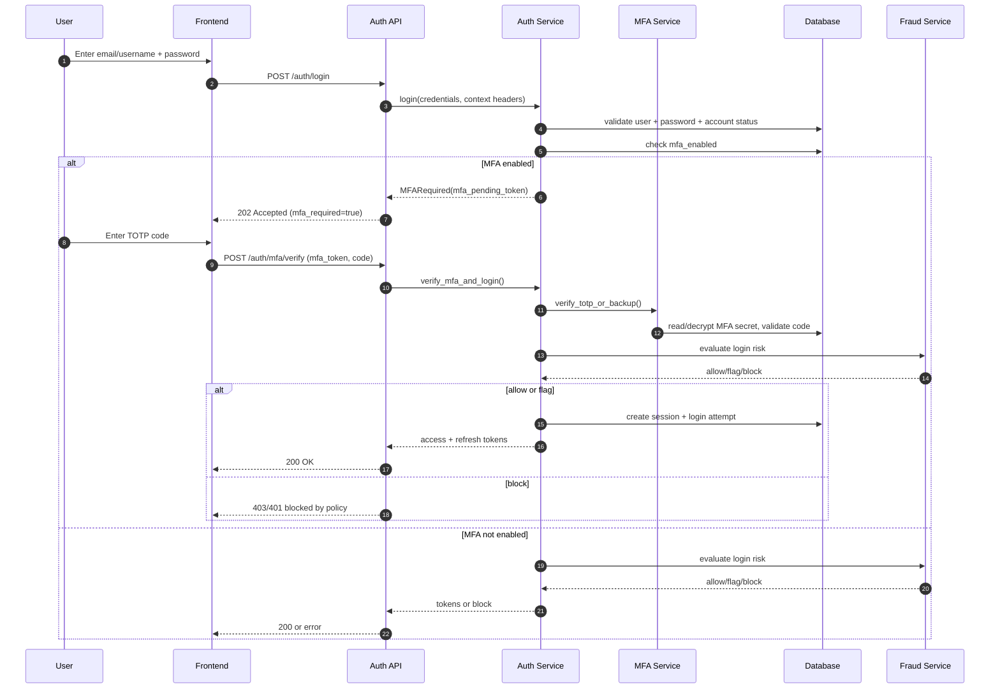
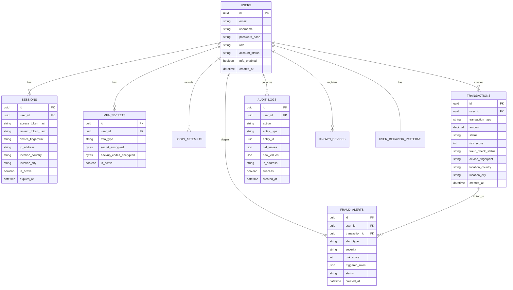
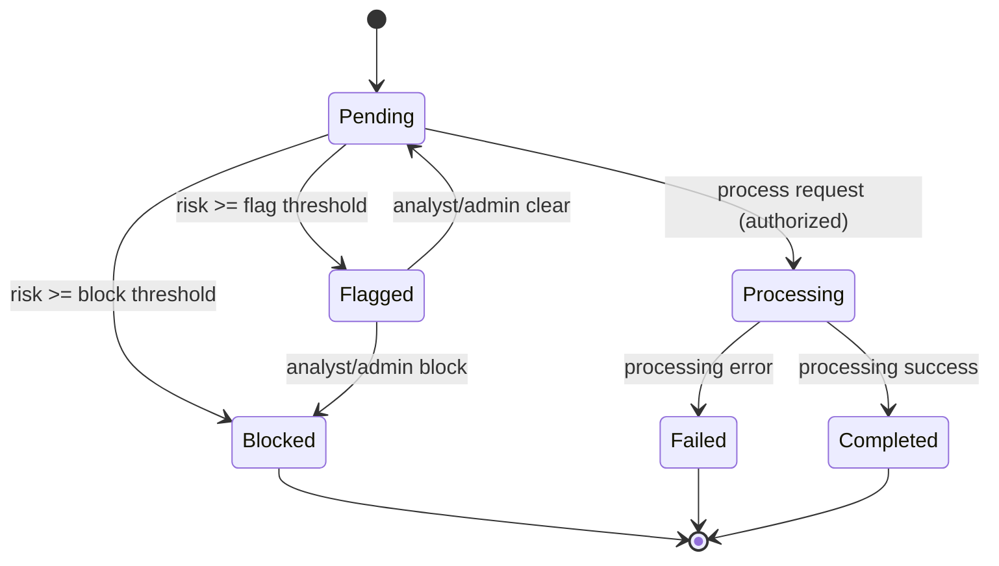
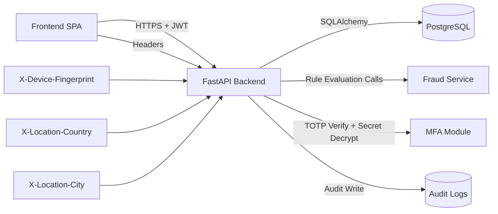

# Secure Banking Presentation Diagram Pack

Use this file as a single copy source for your presentation diagrams.

---

## 1) Use Case Diagram (PlantUML)



---

## 2) Login + MFA Sequence Diagram (Mermaid)



---

## 3) ER/Data Model Diagram (Mermaid)



---

## 4) Transaction Lifecycle State Model (Mermaid)



---

## 5) Communication/Protocol Diagram (Mermaid)



---

## 6) Prompt for Eraser / Replit AI Diagram Tools

```text
Generate professional UML diagrams for a secure online banking prototype with roles user, analyst, admin.

Include:
1. Use case diagram for registration, login, MFA setup/verify, transaction creation, fraud alert investigation, admin user/status/role/session management, audit log access.
2. Sequence diagram for login with MFA pending token and TOTP verification.
3. ER diagram with tables: users, sessions, mfa_secrets, login_attempts, transactions, fraud_alerts, audit_logs, known_devices, user_behavior_patterns.
4. State machine (Petri-net style) for transaction lifecycle: pending -> flagged/blocked/processing -> completed/failed.
5. Communication model showing frontend HTTPS calls, device/location headers, backend service layers, fraud engine, and database.

Add security notes:
- JWT scope-based access control
- rate limiting on auth endpoints
- audit trail for privileged actions
- analyst/admin workflow for flagged transactions

Use clear labels, actor boundaries, and banking-grade visual style suitable for academic presentation.
```

---

## 7) Quick Tool Notes

- PlantUML block works in: PlantUML renderers, VSCode PlantUML plugin, online PlantUML servers.
- Mermaid blocks work in: Mermaid Live Editor, Eraser markdown, many markdown-enabled tools, Replit docs.
- If a tool supports one format only:
  - Use PlantUML for use case
  - Use Mermaid for sequence, ER, state, and flow

